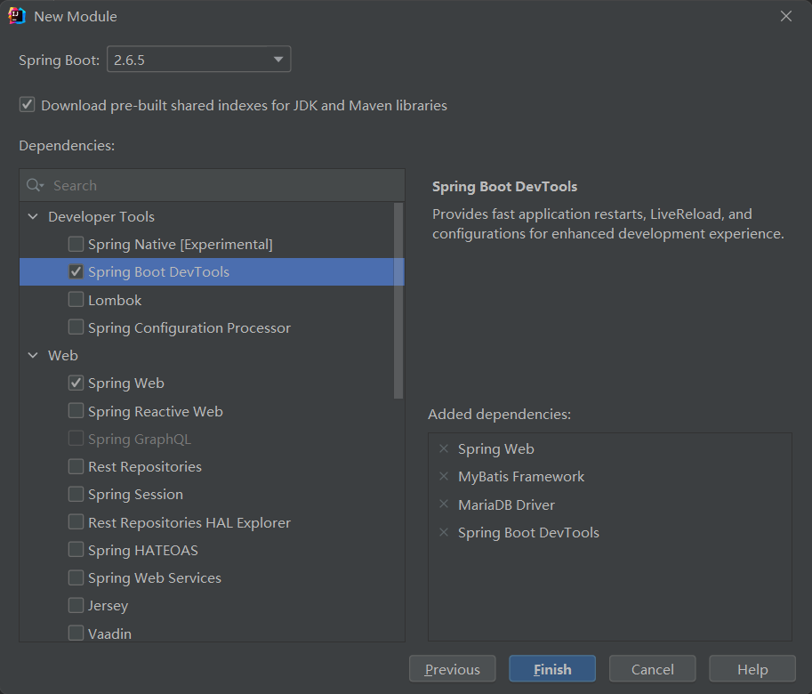

# 2022/03/27

## 使用idea搭建spring boot项目

[参考链接](https://www.cnblogs.com/ohuo/p/12232527.html)




问题：
* server部署MariaDB、Nginx等服务。

* 前后端分离项目需要配置Nginx服务。

* 前端临时index.html文件的编写

* 服务器的部署与测试

* ~~logback日志~~

Logback配置
[参考资料](https://liyan.blog.csdn.net/article/details/79036447?spm=1001.2101.3001.6650.1&utm_medium=distribute.pc_relevant.none-task-blog-2%7Edefault%7ECTRLIST%7ERate-1.pc_relevant_default&depth_1-utm_source=distribute.pc_relevant.none-task-blog-2%7Edefault%7ECTRLIST%7ERate-1.pc_relevant_default&utm_relevant_index=2)

使用方法
`private static Logger log = LoggerFactory.getLogger(ClassName.class);`


长期：

* SSM框架和spring boot的使用。

* RPC框架的使用。

# 2022/03/28

## webStorm 搭建vue项目

1. nodejs安装。

中间选add to path，其他的默认一直安装就行

遇到问题：

* ~~webpack -v 找不到命令。~~

  ~~需要配置node_cace node_global 以及环境变量~~

这里可以不需要，直接安装nodejs，然后配置node_chache & node_global，然后直接`npm install @vue/cli -g`即可使用了

* npm项目初始化失败，报错没有权限建立目录

  删除C盘/用户目录中的.npmrc文件，把他删除掉就不会有报错Error: EPERM: operation not permitted, mkdir了

* npm install的时候报错

    不使用淘宝源（缺少一些库），直接npm install 就行了

* 可以使用 vue-element-admin项目验证搭建是否成功


# 2022/03/29

1. logback引入

2. 项目所有文件格式都需要设置为UTF-8

3. 框架搭建完毕，项目可以跑通。接下来就是服务器搭建和项目各项配置文件的修改。比如logback.xml

4. 在项目部署之前，先搭建一个WordPress，根据WordPress的架构和页面，第一步确定需要哪些功能，实现哪些接口等，然后基于
这个框架和设计再进行初步的开发。先开发server端，再开发前端。vue的基础知识可以看一下。之后的开发尽量与学习同步。WordPress的工作预计假期搞定。

# 2022/03/31

## 1. MariaDB 安装与配置
```shell
:~$ sudo apt install mariadb-server
```
默认情况下，新安装的 mariadb 的密码为空，在shell终端直接输入 mysql 就能登陆数据库。
如果是刚安装第一次使用，请使用 mysql_secure_installation 命令初始化。

## 2. 登陆数据库修改密码。

 更新 mysql 库中 user 表的字段：
```sql
MariaDB [(none)]> use mysql;  
MariaDB [mysql]> UPDATE user SET password=password('newpassword') WHERE user='root';
```
或者
```sql
MariaDB [mysql]> ALTER USER 'root'@'localhost' IDENTIFIED BY 'newpassword';
MariaDB [mysql]> flush privileges;  
MariaDB [mysql]> exit;
```
或者，使用 set 指令设置root密码：
```sql
MariaDB [(none)]> SET password for 'root'@'localhost' = password('newpassword');  
MariaDB [(none)]> exit; 
```


## 3. 新建一个my用户并且授权全部操作权限

```sql
MariaDB [(none)]> grant all privileges on *.* to my@localhost identified by '123456';
Query OK, 0 rows affected (0.00 sec)

MariaDB [(none)]> select user from mysql.user;
```

dbuser@1q2w3e@4R

# 2022/04/05

## Nginx安装

```shell
$ sudo apt install nginx

$ service nginx start  
```

开启nginx服务后，访问ip/域名，如果看到nginx的提示，即为安装成功。

nginx文件安装完成之后的文件位置：

/usr/sbin/nginx：主程序

/etc/nginx：存放配置文件

/usr/share/nginx：存放静态文件

/var/log/nginx：存放日志

## Nginx配置

```editorconfig
 server
  {
    listen 80;#监听端口
    server_name localhost;#域名
    index index.html index.htm index.php;
    root /usr/local/webserver/nginx/html;#站点目录
      location ~ .*\.(php|php5)?$
    {
      #fastcgi_pass unix:/tmp/php-cgi.sock;
      fastcgi_pass 127.0.0.1:9000;
      fastcgi_index index.php;
      include fastcgi.conf;
    }
    location ~ .*\.(gif|jpg|jpeg|png|bmp|swf|ico)$
    {
      expires 30d;
  # access_log off;
    }
    location ~ .*\.(js|css)?$
    {
      expires 15d;
   # access_log off;
    }
    access_log off;
  }
```

nginx.conf中，server需要配置在http的范围中。

检查配置文件nginx.conf的正确性命令：

```shell
# /usr/local/webserver/nginx/sbin/nginx -t
```

重启nginx。

## nginx常用命令

```shell
/usr/sbin/nginx -s reload            # 重新载入配置文件
/usr/sbin/nginx -s reopen            # 重启 Nginx
/usr/sbin/nginx -s stop              # 停止 Nginx
```