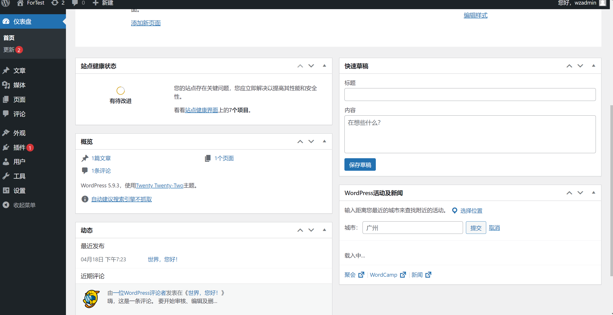

# 方案设计

## 1. 前端设计
前端共分为两个部分：用于展示的页面、用于管理的后台
### 展示页面1--首页：
  
首页共分为三个部分，

第一部分主要是展示网站信息，图之类的，比示例上的窄，用于展示网站的标题等。图的下面用于放置功能模块。

第二部分是内容部分，分三栏，左栏是导航栏，用于展示小模块，充当面包屑的功能，中间是最近更新的内容，
或者后面看找个好看的图、视频等。右侧用于放置一些凌杂的信息。

第三部分就是页脚，主要可放置联系方式，网站的备案信息等。

### 展示页面2--内容模块：

模仿CSDN的风格，右侧信息可以更改

### 展示页面3--内容展示：

依旧模仿CSDN的风格，不过要去掉左侧的页面展示。
页面标题、信息、图片等模仿CSDN的风格，支持MarkDown风格的文件展示，因为大量的已有的文件都是基于
MarkDown的，最好能使用插件，直接从MarkDown渲染成风格合适的页面。

### 管理页面1--总管理

页面风格模仿WordPress，可以套用vue-admin的模块，大致这个风格。

### 管理页面2--编辑文章：
前期只准备支持文章这一种类型的blog，后续可以加入其他类型。
暂时只使用开源的富文本编辑器，支持MarkDown编辑，如果使用MarkDown编辑，需要将其保存为
MarkDown格式的文件进行备份。如果不使用MarkDown编辑，则将其转化为PDF进行保存备份。
风格依旧模仿CSDN。

### 管理页面3--登陆界面
这个就没啥好说的，简单的就行

### 管理页面4
小功能合集

服务器状态查看，历史状态图表，包含CPU、内存、磁盘等数据
访问量统计、更新统计等。

最近比较忙，更新缓慢，后续五一期间应该会完成整体设计，开始开发。最近一段时间先设计页面及相关接口、功能吧。
