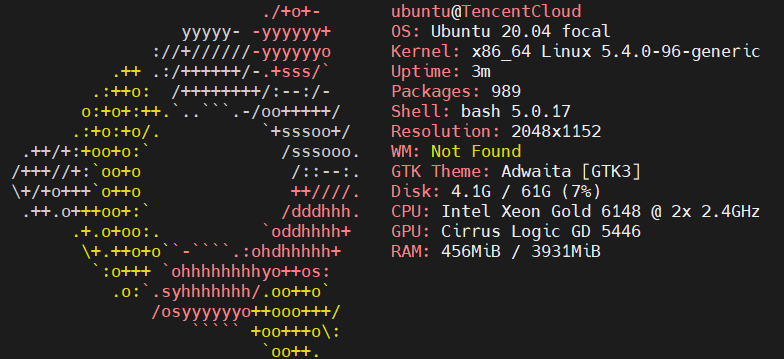

# 服务器基础配置

## 1.服务器安装jdk

服务器详情


偷懒直接用的apt install
```shell
ubuntu@TencentCloud:~$ java -version
openjdk version "1.8.0_312"
OpenJDK Runtime Environment (build 1.8.0_312-8u312-b07-0ubuntu1~20.04-b07)
OpenJDK 64-Bit Server VM (build 25.312-b07, mixed mode)
```

